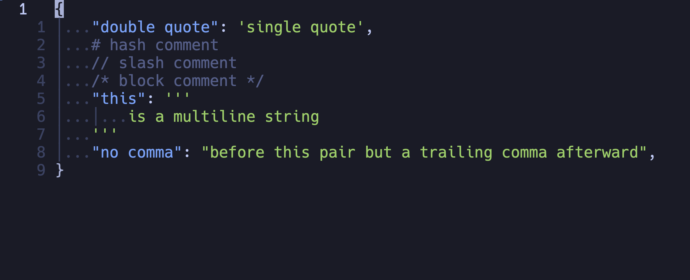

tree-sitter-hjson
===========================

hjson grammar for [tree-sitter](https://github.com/tree-sitter/tree-sitter)

Heavily based on [tree-sitter-json](https://github.com/tree-sitter/tree-sitter-json) and [tree-sitter-jsonc](https://gitlab.com/WhyNotHugo/tree-sitter-jsonc)

## Demo

Syntax highlight with neovim.

## Features

[x] Handle trailing commas

[x] Handle omitting commas

[x] Handle multiline strings

[ ] Handle quoteless strings

[ ] Handle escape sequence in quoted strings
